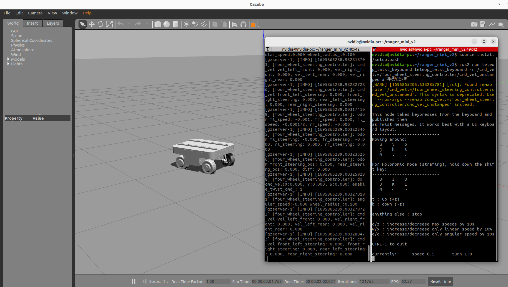

### 一. 仿真四舵轮ranger_mini_v2
```
nick@nick-vmware:~/ranger_mini_v2$ colcon build
nick@nick-vmware:~/ranger_mini_v2$ source install/setup.bash
nick@nick-vmware:~/ranger_mini_v2$ ros2 launch ranger_mini_v2_gazebo ranger_mini_v2_empty_world.launch.py # 在gazebo中显示车体模型
nick@nick-vmware:~/ranger_mini_v2$ ros2 run teleop_twist_keyboard teleop_twist_keyboard -r /cmd_vel:=/four_wheel_steering_controller/cmd_vel_unstamped # 手动遥控
```

### 二.实体机运行，显示rviz2。加载实体电机驱动时，将修改宏 PHYSICAL_MACHINE 为 1 重新编译
```
nick@nick-vmware:~/ranger_mini_v2$ colcon build
nick@nick-vmware:~/ranger_mini_v2$ source install/setup.bash
nick@nick-vmware:~/ranger_mini_v2$ ros2 launch ranger_mini_v2_gazebo display_real.launch.py # 显示实体机模型，并加载实际物理驱动
nick@nick-vmware:~/ranger_mini_v2$ ros2 run teleop_twist_keyboard teleop_twist_keyboard # 手动遥控


nick@nick-vmware:~/ranger_mini_v2$ sudo dpkg -i libmotor-driver-2.0.20230801_amd64.deb # 实体车上编译时，需要将库安装
nick@nick-vmware:~/ranger_mini_v2$ export LD_LIBRARY_PATH=/usr/local/bzl_robot/lib:$LD_LIBRARY_PATH # 实体车上运行时, 设置动态库环境变量
```

--------------
--------------
--------------

将xacro转为URDF
```
nick@nick-vmware:~/ranger_mini_v2/src/ranger_mini_v2_gazebo/xacro$ xacro ranger_mini_gazebo.xacro > ranger_mini_gazebo.urdf
```
将URDF转换为SDF；然后将sdf重命名为ranger_mini_v2.sdf，放置到ranger_mini_v2/src/ranger_mini_v2/ranger_mini_v2.sdf
```
nick@nick-vmware:~/ranger_mini_v2/src/ranger_mini_v2_gazebo/xacro$ gz sdf -p ranger_mini_gazebo.urdf > ranger_mini_gazebo.sdf
```




